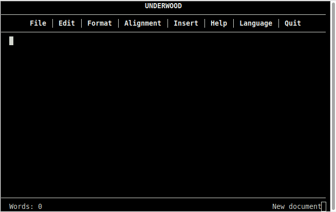

# Lightwrite

Terminal word processor for Debian and derivatives (curses + RTF).
Fork of [SilvestreParbut/Underwood](https://github.com/SilvestreParbut/Underwood)
maintained at [magiccityreader/Lightwrite](https://github.com/magiccityreader/Lightwrite).

Inspired by WordPerfect, MS-Word 6.0 for DOS, and the Underwood Standard No. 5.



## Features

- Bold, italic, underline, headings, page breaks, alignment
- Native `.rtf` (also `.txt`; `.docx` / PDF via LibreOffice)
- Mouse selection / scroll, or keyboard-only (`Shift`+arrows, `F9` menus)
- Hunspell spell-check (optional), find/replace, bilingual UI (es/en)

## Run from source

```bash
python3 src/lightwrite.py
# or open a file:
python3 src/lightwrite.py ~/notes/draft.rtf
```

Optional: `hunspell` (+ dictionaries), `xclip`/`xsel`, LibreOffice Writer.

## Build a `.deb` (Linux)

```bash
./scripts/build-deb.sh
sudo apt install ./dist/lightwrite_1.0.0_all.deb
```

## Layout

| Path | Role |
|------|------|
| `src/lightwrite.py` | Application |
| `src/locale/` | Manual / About text (es + en) |
| `packaging/` | Desktop entry, icon, Debian metadata |
| `scripts/build-deb.sh` | Assemble `.deb` from source |
| `assets/screenshots/` | UI screenshots |

Release tarballs and PyInstaller/venv trees are **not** kept in git.

## License

GNU GPL v3 — see [LICENSE](LICENSE). Upstream copyright Silvestre Parbut (2026).
